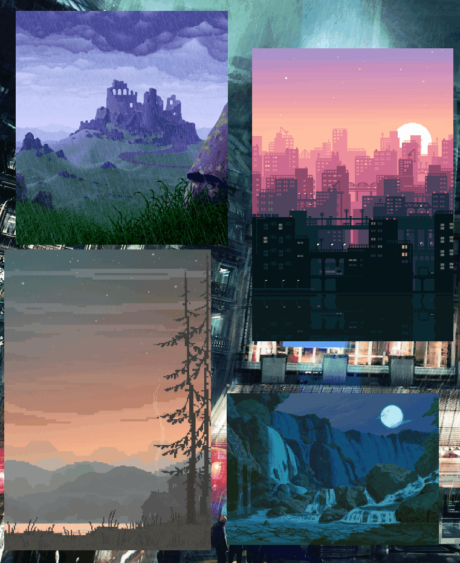

# Sticky Image Manager

[](https://github.com/darkmusic/sticky-image-manager/actions/workflows/maven-publish.yml)[](https://github.com/darkmusic/sticky-image-manager/actions/workflows/maven.yml)

This is an application that allows you to manage and launch multiple instances of a Viewer.  It is written in Java 25 and uses JavaFX for the UI.

It is designed to add some ambience to your desktop (if you have the available screen space).

Features:

- Allows individual image viewers to be resized and repositioned as desired
- Remembers positions, images, and sizes so they can be restored upon the next launch
- Supports EXIF rotation
- Stores recent images in a list for easy access
- Remembers the last directory when browsing for an image in the viewer's file dialog
- Supports GIF animations




It consists of two parts:

1. **Sticky Image Manager**: A simple application that allows you to manage and launch multiple instances of a Viewer.

*Sticky Image Manager*:


1. **Sticky Image Viewer**: A simple application that allows you to view images and videos.

*Empty Viewer (right-click to bring up context menu to allow loading / closing image)*:


It supports EXIF rotation if present.

You can resize images if needed by dragging a corner or a side.  It will maintain the aspect ratio of the image.

## Building

1. Install JDK 25 (GraalVM JDK 25+37.1 has been confirmed to work) and Maven.
2. Make sure your JAVA_HOME is set in `justfile`.

   ```bash
   export JAVA_HOME := /path/to/your/jdk
   ```

3. Install [Just](https://just.systems/) if you don't have it already.
4. In the project root, run:

   ```bash
   just build
   ```

## Running

```bash
just run
```

## System Requirements

- Java Runtime, currently tested with Java 25 (GraalVM-25+37.1)
- Maven
- OS: Windows, Linux, MacOS
- Just CLI tool (for building and running)

## License
This project is licensed under the MIT License - see the [LICENSE](LICENSE) file for details.

## Roadmap
- [X] Support movement and resizing in undecorated mode
- [X] Remove decorated mode once functionality has been confirmed in undecorated mode
- [X] Improve resizing logic so no filling is needed
- [X] Fix EXIF rotation issues
- [ ] Add drag-and-drop support
- [ ] Add support for multiple images per viewer (slideshow)
- [ ] Add support for video files
- [ ] Add support for image transitions
- [ ] Add support for image effects (grayscale, sepia, etc.)
- [ ] Find replacement for metadata-extractor, as this currently results in a "required filename-based automodules" warning during the build
- [ ] Fix other build warnings such as `sun.misc.Unsafe::allocateMemory`
- [ ] Create release build with jlink
- [ ] Create installer for Windows, MacOS, and Linux
- [ ] Add more documentation